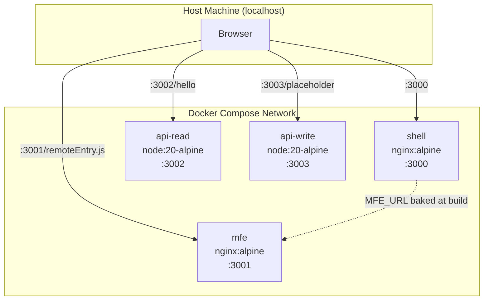

# Design Document: Docker Compose Integration

## Overview

This design adds Docker-based compose to the todo-m distributed system alongside the existing process-based local compose. Each of the four components (shell, mfe, api-read, api-write) gets a Dockerfile and, where needed, an nginx config. A `docker-compose.yml` in the root repo wires them together. The `project.yaml` topology manifest gains port declarations and a compose section that distinguishes the two strategies (process for local dev, docker-compose for integration).

The key constraint: the existing `npm run compose` / `compose:stop` workflow is untouched. Docker compose is additive — a parallel path under `compose:docker*` scripts.

### Port Assignments

| Component | Port | Role |
|-----------|------|------|
| shell | 3000 | Frontend host (nginx) |
| mfe | 3001 | MFE remote (nginx) |
| api-read | 3002 | Express GET /hello |
| api-write | 3003 | Express POST /placeholder |

### Build-Time Environment Variables

| Variable | Set In | Value | Consumed By |
|----------|--------|-------|-------------|
| MFE_URL | Shell Dockerfile | http://localhost:3001 | webpack ModuleFederationPlugin remote URL |
| API_URL | MFE Dockerfile | http://localhost:3002 | webpack DefinePlugin, used by Hello.jsx fetch |

These are baked into the webpack build output at image build time. They resolve in the browser (not inside the container network), so they use `localhost` — not Docker service names.

## Architecture



All traffic flows through the browser. The shell's webpack build has `MFE_URL=http://localhost:3001` baked in, so the browser fetches `remoteEntry.js` directly from the MFE container's mapped port. Similarly, the MFE's `API_URL=http://localhost:3002` means the browser calls the API directly. No container-to-container HTTP traffic at runtime.

## Components and Interfaces

### 1. Backend Dockerfiles (api-read, api-write)

Identical structure for both backends. No multi-stage needed — there's no build step.

```dockerfile
FROM node:20-alpine
WORKDIR /app
COPY package.json package-lock.json ./
RUN npm ci --omit=dev
COPY src/ src/
EXPOSE <port>
CMD ["node", "src/server.js"]
```

The `PORT` env var is already respected by both `server.js` files (`process.env.PORT || <default>`). The docker-compose.yml sets `PORT` to match the exposed port.

### 2. Frontend Dockerfiles (shell, mfe)

Multi-stage builds. Stage 1 installs deps and runs webpack production build. Stage 2 copies the `dist/` output into an nginx:alpine image.

**MFE Dockerfile:**
```dockerfile
# Stage 1: Build
FROM node:20-alpine AS build
WORKDIR /app
COPY package.json package-lock.json ./
RUN npm ci
COPY . .
ARG API_URL=http://localhost:3002
ENV API_URL=$API_URL
RUN npm run build

# Stage 2: Serve
FROM nginx:alpine
COPY --from=build /app/dist /usr/share/nginx/html
COPY nginx.conf /etc/nginx/conf.d/default.conf
EXPOSE 3001
```

**Shell Dockerfile:**
```dockerfile
# Stage 1: Build
FROM node:20-alpine AS build
WORKDIR /app
COPY package.json package-lock.json ./
RUN npm ci
COPY . .
ARG MFE_URL=http://localhost:3001
ENV MFE_URL=$MFE_URL
RUN npm run build

# Stage 2: Serve
FROM nginx:alpine
COPY --from=build /app/dist /usr/share/nginx/html
COPY nginx.conf /etc/nginx/conf.d/default.conf
EXPOSE 3000
```

### 3. Nginx Configurations

**Shell nginx.conf** — straightforward static file serving:
```nginx
server {
    listen 3000;
    root /usr/share/nginx/html;
    index index.html;

    location / {
        try_files $uri $uri/ /index.html;
    }
}
```

**MFE nginx.conf** — static serving plus CORS headers for `remoteEntry.js`:
```nginx
server {
    listen 3001;
    root /usr/share/nginx/html;
    index index.html;

    location / {
        add_header Access-Control-Allow-Origin *;
        add_header Access-Control-Allow-Methods "GET, OPTIONS";
        add_header Access-Control-Allow-Headers "*";
        try_files $uri $uri/ /index.html;
    }
}
```

The CORS headers are essential — the browser loads `remoteEntry.js` from `localhost:3001` while the shell page is served from `localhost:3000`. Without `Access-Control-Allow-Origin: *`, Module Federation fails silently.

### 4. Docker Compose File

Lives at the root repo root. Build contexts use relative paths to sibling repos.

```yaml
services:
  shell:
    build:
      context: ./packages/shell
    ports:
      - "3000:3000"
    depends_on:
      - mfe
      - api-read
      - api-write

  mfe:
    build:
      context: ../todo-m-mfe
    ports:
      - "3001:3001"

  api-read:
    build:
      context: ../todo-m-api-read
    ports:
      - "3002:3002"
    environment:
      - PORT=3002

  api-write:
    build:
      context: ../todo-m-api-write
    ports:
      - "3003:3003"
    environment:
      - PORT=3003
```

Design decisions:
- `depends_on` on shell ensures backends and MFE start first (no health checks — simple ordering is sufficient for this reference impl)
- Build args for `MFE_URL` and `API_URL` use defaults in the Dockerfiles, so no explicit `args:` needed in compose
- Backend `PORT` env vars are set explicitly for clarity, even though the Dockerfiles default correctly

### 5. .dockerignore Files

Each component gets a `.dockerignore` to exclude `node_modules/` from the build context. This prevents the host's `node_modules` from being sent to Docker (large, wrong platform).

```
node_modules
.git
dist
```

### 6. project.yaml Updates

Add `port` to each component. Add `compose` section with both strategies:

```yaml
components:
  - name: shell
    type: embedded
    location: ./packages/shell
    tag: v0.1.0
    role: frontend-host
    port: 3000

  - name: mfe
    type: referenced
    location: methodology-m/todo-m-workshop/todo-m-mfe
    tag: v0.1.0
    role: frontend
    port: 3001

  - name: api-read
    type: referenced
    location: methodology-m/todo-m-workshop/todo-m-api-read
    tag: v0.1.0
    role: backend
    port: 3002

  - name: api-write
    type: referenced
    location: methodology-m/todo-m-workshop/todo-m-api-write
    tag: v0.1.0
    role: backend
    port: 3003

compose:
  local:
    strategy: process
    script: scripts/start-all.sh
    stop: scripts/stop-all.sh

  integration:
    strategy: docker-compose
    file: docker-compose.yml
    build: true
    health:
      timeout: 30
      endpoints:
        - http://localhost:3000
        - http://localhost:3001/remoteEntry.js
        - http://localhost:3002/hello
        - http://localhost:3003/placeholder
```

### 7. NPM Scripts

Added to root repo `package.json`:

```json
{
  "compose:docker:build": "docker compose build",
  "compose:docker": "docker compose up -d",
  "compose:docker:stop": "docker compose down"
}
```

The `-d` flag on `compose:docker` runs containers in detached mode, returning control to the terminal — matching the user expectation from Requirement 5.4.

## Data Models

No new data models. This feature is purely infrastructure configuration. The only structured data is the `project.yaml` schema extension (port field on components, compose section), documented above.

## Error Handling

| Scenario | Handling |
|----------|----------|
| Docker not installed | `docker compose` commands fail with a clear system error. No custom handling needed — the error message is self-explanatory. |
| Port already in use | Docker maps fail with "port already allocated". Developer must stop conflicting process (e.g. `npm run compose:stop` if local compose is running). |
| Sibling repo not cloned | `docker compose build` fails with "build context not found". The relative paths (`../todo-m-mfe`, etc.) require sibling repos to be present. |
| webpack build failure | Multi-stage Docker build fails at stage 1. Error output shows the webpack error. Developer fixes source and rebuilds. |
| CORS misconfiguration | Module Federation fails silently in the browser — shell loads but MFE doesn't render. Console shows CORS error. Fix: verify MFE nginx.conf has `Access-Control-Allow-Origin: *`. |
| Stale images | After code changes, `docker compose up` uses cached images. Developer must run `compose:docker:build` (or `docker compose up --build`) to rebuild. |

## Testing Strategy

This feature is infrastructure configuration — Dockerfiles, nginx configs, YAML, and shell scripts. There is no application logic to test with property-based testing. The acceptance criteria are all verifiable through integration/smoke testing:

- **Smoke tests**: Container builds successfully, container starts and listens on expected port
- **Integration tests**: Existing Cypress tests (`pats/TODOM-000.cy.js`) pass against the Docker composed system without modification — this is the primary validation
- **Manual verification**: `docker compose up -d`, then open `http://localhost:3000` in a browser, confirm MFE loads via Module Federation, confirm API message displays

Property-based testing does not apply here because:
1. Dockerfiles are declarative build instructions, not functions with inputs/outputs
2. nginx configs are static configuration, not logic
3. docker-compose.yml is declarative service wiring
4. project.yaml changes are schema additions, not transformations
5. NPM scripts are one-line shell commands

The existing Cypress integration tests are the correct validation mechanism — they already test the full composed system end-to-end (shell renders, MFE loads, API responds). Running them against Docker compose instead of process compose proves the Docker setup is equivalent.
