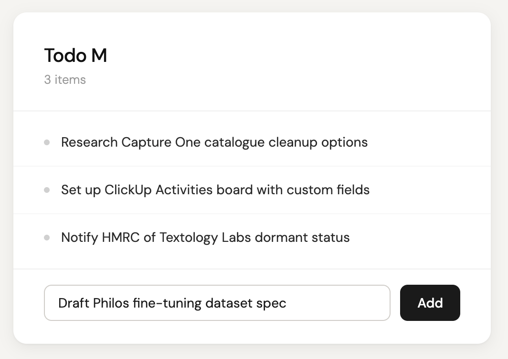
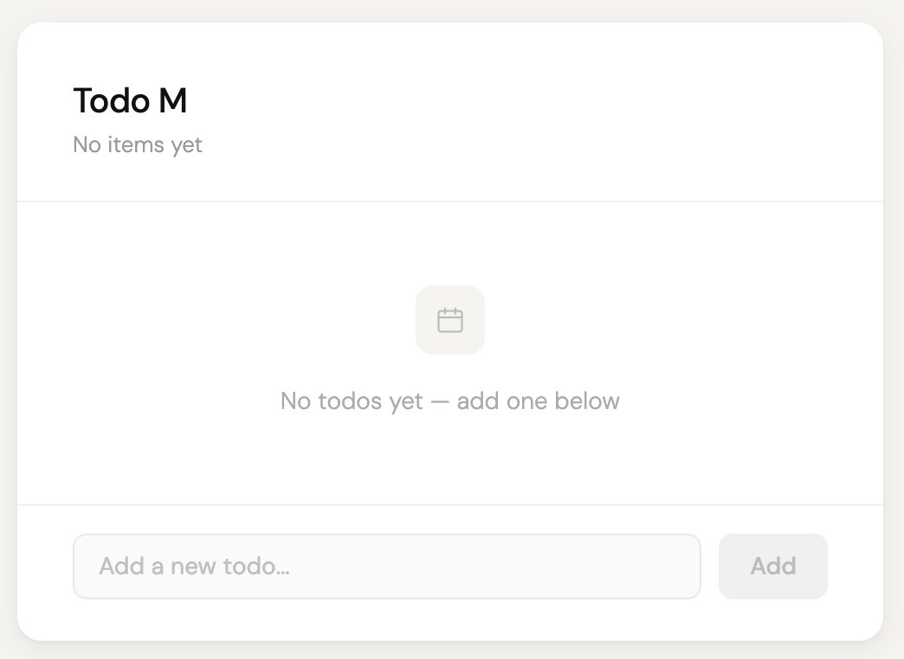

# TODOM-001: User can view and add todos

**Type:** User Story
**Status:** Pending
**Created:** 2026-04-05

## Summary

As a user, I want to see my list of todos and add new ones, so that I
can keep track of what I need to do.

This is the first feature story after infrastructure bootstrap (TODOM-000).
It exercises all four components in the distributed system: the read API
serves the todo list, the write API accepts new todos, the microfrontend
renders the UI and handles user interaction, and the shell composes
everything.

## UX Reference

Key design notes:
- Centred card layout, clean minimal aesthetic
- Item count shown below heading ("3 items" / "No items yet")
- Bullet-style list, no checkboxes (read-only for this story)
- Add input + button at bottom, button disabled when input empty
- Empty state: icon + "No todos yet — add one below" message

## Acceptance Criteria

1. Todo list is displayed on load
   - When the user opens the app, a list of todos is displayed
   - Each todo shows its title
   - Todos are fetched from the read API

2. Empty state is handled gracefully
   - When there are no todos, a friendly message is shown (e.g. "No todos yet — add one below")
   - The add form is still visible and usable

3. User can add a new todo
   - There is a text input and an "Add" button
   - When the user types a title and clicks "Add", the todo is sent to the write API
   - The new todo appears in the list without a full page reload
   - The input is cleared after successful submission

4. Validation prevents empty todos
   - The "Add" button is disabled when the input is empty
   - No request is sent to the API for empty submissions

5. The composed system works end-to-end
   - The shell loads and composes the microfrontend
   - The microfrontend communicates with both APIs
   - Adding a todo via the write API makes it appear via the read API
   - The full flow works in the Docker Compose environment
